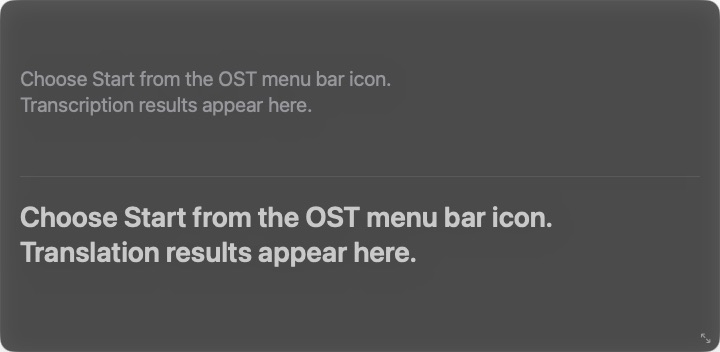
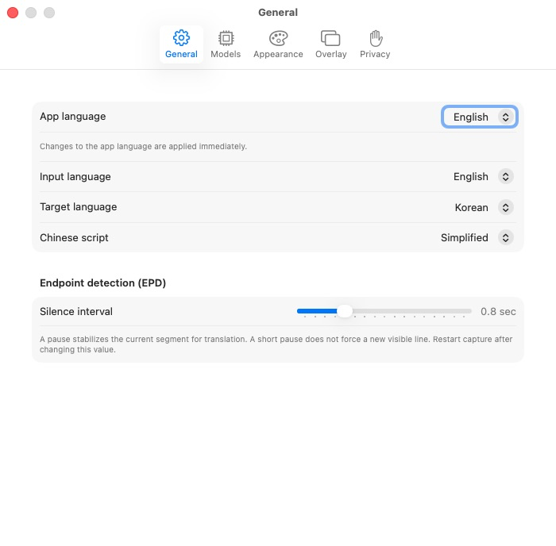

🇬🇧 English | [🇰🇷 한국어](README.ko.md) | [🇨🇳 中文](README.zh.md) | [🇯🇵 日本語](README.ja.md)

# OST — On-Screen Translator

OST is a menu bar app for macOS 26+ that transcribes system audio and shows on-device translation subtitles in a floating overlay. It is designed for videos and meetings, where disappearing, blinking, or duplicated text is a serious usability failure.

## Screenshots

### Combined overlay



### General settings



## Highlights

- Apple Speech and Apple Translation are the default on-device providers.
- Apple Speech supports English, Chinese (Simplified and Traditional), Japanese, and Korean when the corresponding system locale is available.
- Optional Qwen3 ASR and translation models run locally with MLX.
- Confirmed transcript and translation history stay visible while two separate lines are reserved for the current preview.
- Each transcript and translation area supports 2–10 confirmed lines; the window resizes when this value changes.
- Left alignment is the default, with center and right alignment available.
- Transcript, confirmed translation, and current translation preview have separate font/color controls and live examples.
- EPD is used as a soft translation boundary and does not force a new visible line for every pause.
- The app UI supports English, Chinese, Japanese, and Korean. English is the default.
- Optional per-session transcript and translation files are off by default and are saved only to a folder selected by the user.

## Privacy

Audio, transcripts, and translations are processed on the Mac. OST has no feature that uploads or sends audio, transcripts, translations, settings, or saved session files outside the computer.

Internet access is used only when the user chooses to download an MLX model. The sandboxed downloader receives model files; user content is never passed to it.

## Requirements

- macOS 26.0 or later
- Apple Silicon

## Install 0.2.2

Download `OST-0.2.2-macos-arm64.zip` from the [v0.2.2 release](https://github.com/9bow/OST/releases/tag/v0.2.2), extract it, and move `OST.app` to Applications.

The current binary is ad-hoc signed because a Developer ID certificate was not available in the release environment. If macOS quarantine reports that the app cannot be verified or is damaged, remove the quarantine attribute after confirming that you downloaded it from this repository:

```bash
xattr -dr com.apple.quarantine /Applications/OST.app
```

The release ZIP SHA-256 is published by the release workflow and can be compared with:

```bash
shasum -a 256 OST-0.2.2-macos-arm64.zip
```

## Start transcribing

1. Launch OST and allow System Audio Capture when macOS asks.
2. Select the OST captions icon in the menu bar.
3. Choose the input and target languages, then choose **Start**.
4. Use **Settings > Overlay** to unlock, move, resize, or change the number of confirmed lines.

## Optional session files

Open **Settings > Privacy**, enable **Save each session to text files**, and choose a folder. One capture start-to-stop interval is one session. OST creates separate timestamped transcript and translation files. This option is off by default and never saves audio.

## Build and test

The project uses SwiftPM plus an Xcode app/XPC project.

```bash
swift package --disable-sandbox resolve
swift test --disable-sandbox --disable-automatic-resolution --jobs 4
script/test.sh
script/build_and_run.sh run
```

See [docs/manual-qa.md](docs/manual-qa.md) for the release checklist.

## License

[MIT](LICENSE)
